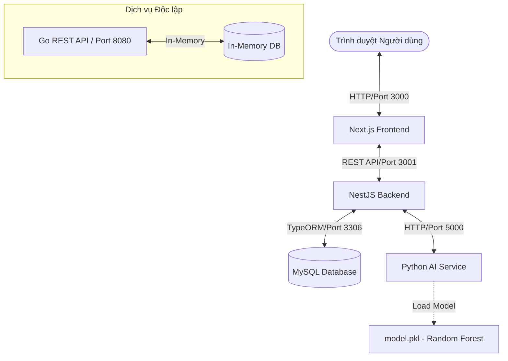

# Traffic Bot & System Management

Hệ thống giám sát lưu lượng mạng, sinh dữ liệu giả lập và phát hiện bot truy cập (Traffic Bot Detection) sử dụng học máy (Machine Learning). Dự án tích hợp giao diện quản trị hiện đại, dịch vụ AI phân tích log và hệ thống quản lý backend hiệu năng cao.

---

## 🏗️ Kiến trúc Hệ thống

Dưới đây là mô hình giao tiếp giữa các thành phần trong hệ thống:



---

## 📁 Cấu trúc Thư mục Dự án

```text
doantotnghiep/
├── admin-web/
│   └── traffic-bot-system/      # Giao diện quản trị Next.js (React 19, Ant Design, Recharts)
├── AI-service/                  # Dịch vụ AI Flask (Huấn luyện, phân tích log, dự đoán bot)
├── system-management/           # Backend chính NestJS (Quản lý luồng dữ liệu, lưu logs, xác thực)
│   └── go-api/                  # REST API phụ bằng Go (Thử nghiệm hiệu năng lưu trữ in-memory)
├── docker-compose.yml           # File docker-compose hợp nhất để chạy toàn bộ hệ thống
└── README.md                    # Tài liệu hướng dẫn sử dụng (Tệp này)
```

---

## ⚡ Khởi chạy Nhanh bằng Docker Compose (Khuyên dùng)

Cách nhanh nhất để khởi chạy toàn bộ hệ thống cùng cơ sở dữ liệu là sử dụng Docker Compose. Yêu cầu máy máy tính đã cài đặt **Docker Desktop**.

### 1. Khởi chạy toàn bộ hệ thống
Tại thư mục gốc của dự án, chạy lệnh:

```bash
docker compose up --build -d
```

Lệnh này sẽ tự động xây dựng các Docker Image cho từng dịch vụ và khởi chạy chúng trong cùng một mạng Docker nội bộ.

### 2. Các cổng dịch vụ sau khi chạy Docker
Sau khi các container khởi chạy thành công, bạn có thể truy cập các dịch vụ tại địa chỉ:

| Thành phần | Công nghệ | Địa chỉ URL | Ghi chú |
| :--- | :--- | :--- | :--- |
| **Frontend** | Next.js 16 | [http://localhost:3000](http://localhost:3000) | Giao diện quản trị |
| **Backend** | NestJS | [http://localhost:3001](http://localhost:3001) | REST API & WebSocket |
| **AI Service** | Flask | [http://localhost:5000](http://localhost:5000) | Dịch vụ AI (Health: `/health`) |
| **Go API** | Go | [http://localhost:8080](http://localhost:8080) | API độc lập (Health: `/api/v1/health`) |
| **Database** | MySQL 8.0 | `localhost:3306` | Lưu dữ liệu hệ thống |

---

## 🛠️ Hướng dẫn Phát triển Cục bộ (Chạy tay không qua Docker)

Nếu bạn muốn chỉnh sửa mã nguồn và xem các thay đổi ngay lập tức (Hot Reload), bạn có thể chạy các dịch vụ cục bộ trên máy thật của mình.

### Bước 1: Khởi động cơ sở dữ liệu MySQL
Sử dụng Docker Compose chỉ để khởi động MySQL nhằm tránh phải cài đặt MySQL Server trên máy:

```bash
cd system-management
docker compose up -d mysql
```
*Dữ liệu của MySQL sẽ được lưu bền vững trong Docker volume tên là `mysql_local_data`.*

### Bước 2: Cài đặt và Chạy Backend (NestJS)
1. Di chuyển vào thư mục backend và copy file môi trường:
   ```bash
   cd system-management
   cp .env.example .env
   ```
2. Cài đặt các thư viện Node.js và chạy chế độ phát triển:
   ```bash
   npm install
   npm run start:dev
   ```
   *Backend sẽ chạy tại [http://localhost:3001](http://localhost:3001)*.

### Bước 3: Cài đặt và Chạy Dịch vụ AI (Python Flask)
Dịch vụ này sử dụng Flask để cung cấp các API dự đoán Bot và phân tích Nginx Log.
1. Di chuyển vào thư mục AI-service:
   ```bash
   cd AI-service
   ```
2. Tạo môi trường ảo và kích hoạt nó:
   ```bash
   # Trên Windows:
   python -m venv venv
   venv\Scripts\activate

   # Trên macOS/Linux:
   python3 -m venv venv
   source venv/bin/activate
   ```
3. Cài đặt các thư viện và chạy ứng dụng:
   ```bash
   pip install -r requirements.txt
   python app.py
   ```
   *Dịch vụ AI sẽ chạy tại [http://localhost:5000](http://localhost:5000)*.

*(Tùy chọn) Để huấn luyện lại mô hình phát hiện bot:*
```bash
python generate_synthetic.py  # Sinh dữ liệu mẫu synthetic_data.csv
python train.py               # Huấn luyện mô hình Random Forest và lưu vào model.pkl
```

### Bước 4: Cài đặt và Chạy Frontend (Next.js)
1. Di chuyển vào thư mục frontend:
   ```bash
   cd admin-web/traffic-bot-system
   ```
2. Cài đặt thư viện và chạy chế độ phát triển:
   ```bash
   npm install
   npm run dev
   ```
   *Frontend sẽ chạy tại [http://localhost:3000](http://localhost:3000)*.

---

## ⚙️ Các Biến Môi Trường Quan Trọng

### Backend (`system-management/.env`)
* `PORT`: Cổng chạy backend (mặc định: `3001`).
* `MYSQL_HOST`: Địa chỉ DB (`localhost` khi chạy ngoài, `db` khi chạy Docker).
* `MYSQL_PORT`: Cổng DB (`3306`).
* `MYSQL_USER` / `MYSQL_PASSWORD` / `MYSQL_DATABASE`: Tài khoản kết nối MySQL.
* `MYSQL_SYNCHRONIZE`: Tự động đồng bộ hóa cấu trúc bảng TypeORM (`true` cho demo).
* `AI_SERVICE_URL`: URL gọi API của AI Service (`http://localhost:5000` hoặc `http://ai-service:5000`).

### Frontend (`admin-web/traffic-bot-system/.env.local`)
* `NEXT_PUBLIC_API_BASE_URL`: URL để client-side fetch dữ liệu từ Backend (`http://localhost:3001`).

---

## 🛡️ Tính Năng Chính của Hệ Thống
1. **Phân tích Log Luồng (Nginx Access Logs):** Phân tích danh sách log, trích xuất đặc trưng (Feature Engineering) và dự đoán Bot qua AI.
2. **Dự đoán thời gian thực:** Nhận diện và phân loại truy cập là User thật hay Bot qua các tham số: số request/phút, thời gian session, tỉ lệ click interval, headless browser...
3. **Mô phỏng lưu lượng (Traffic Generation):** Giả lập sinh traffic từ user và bot để minh họa biểu đồ trực quan.
4. **Bảng điều khiển trực quan (Dashboard):** Biểu diễn số lượng truy cập, tỷ lệ bot phát hiện, băng thông, trạng thái HTTP bằng đồ thị trực quan.
